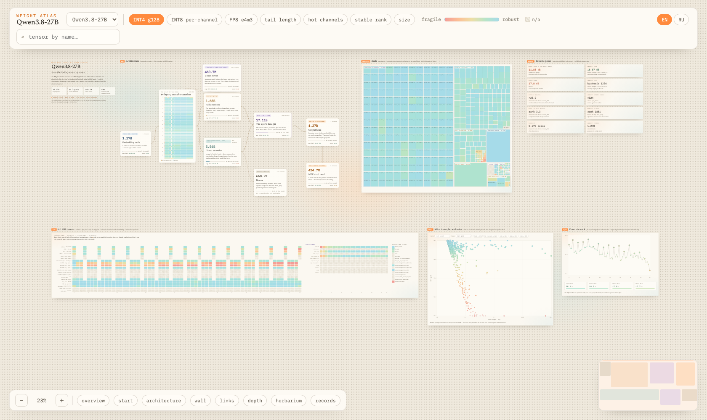
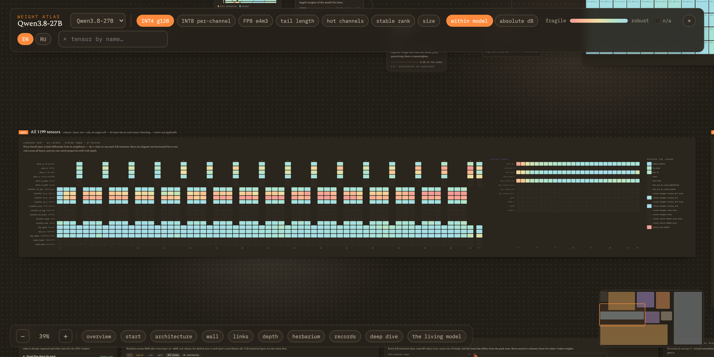
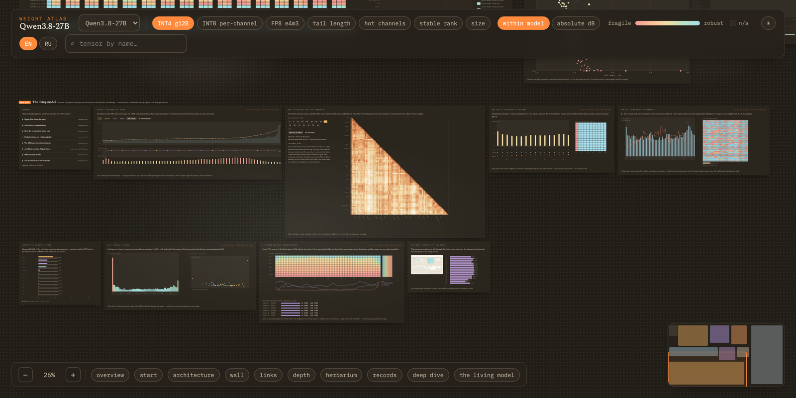

<h1 align="center">Атлас весов</h1>

<p align="center">
  Интерактивное полотно, на котором модель разобрана по тензорам.<br>
  <a href="https://atlas.alesha.pro"><b>atlas.alesha.pro</b></a>
</p>

<p align="center">
  
  
  
  
</p>



Чекпоинт приезжает папкой safetensors-шардов и так и остаётся чёрным ящиком.
Атлас раскладывает его целиком на одно полотно с панорамированием и зумом и
отвечает на один вопрос: **что в этой модели жмётся без потерь, что развалится
и по какой причине.**

В селекторе теперь два принципиально разных вскрытия:

- **Qwen3.8-27B** — 27.78 млрд параметров в 1199 тензорах, снятых прямо с
  оригинальных bf16-шардов.
- **GLM-5.3-Flash NVFP4** — мультимодальный MoE на 320 млрд / 18 млрд активных
  параметров, снятый во время работы выпущенного NVFP4-чекпоинта: 42 × 288
  exact REAP, карты routing и contribution, память KDA, дальность sparse
  indexer, causal Vision arms, deployed quantization и pruning controls.

Для GLM `FC2 QDQ` — реально снятый activation quantize/dequantize с deployed
scale самого чекпоинта. Остальные GLM-панели так же показывают только наши
capture-данные, не переводя их в другой формат.

## Каждое число измерено

Здесь нет эвристик и правил большого пальца. Каждый весовой тензор реально
квантовали и считали ошибку как SQNR в децибелах, `10·log₁₀(‖W‖²/‖W−Ŵ‖²)`, для
трёх схем: INT8 по каналам, INT4 группами по 128 и FP8 e4m3. Спектры — из
настоящих SVD, гистограммы — из настоящих бинов, горячие каналы — из настоящих
максимумов по строкам и столбцам.

Метрики, неприменимые к тензору (нормы, conv1d, смещения), рисуются штриховкой
и подписаны «неприменимо». Они никогда не превращаются молча в ноль.

Съём — один скрипт по шардам, 116 секунд на одной GPU для модели на 27B:

```bash
pip install torch safetensors
python3 scripts/weight_atlas.py /путь/к/чекпоинту atlas.jsonl --device cuda
```

## Что есть на полотне

| Регион | Что показывает |
|---|---|
| **старт** | модель вкратце: параметры, слои, ритм полного и линейного внимания |
| **архитектура** | карта групп от эмбеддинга до головы, с башней зрения и черновой головой MTP, в каждом блоке живые числа |
| **стена** | все 1199 тензоров сразу. Колонка — слой, ряд — роль, поэтому ритм 3:1 и хрупкие ряды видно с одного взгляда |
| **связи** | скаттер любой метрики против любой, с пресетами: длина хвоста, горячие каналы и ранг против урона от INT4 |
| **глубина** | как текущая метрика дрейфует вниз по стеку, по слоям и по четвертям |
| **гербарий** | тримап, где площадь — число параметров |
| **разбор** | вскрытие архитектуры: блок-схемы, интерактивные демо гейтованного внимания, DeltaNet и RoPE, и статьи, откуда каждая часть взялась |
| **живая модель** | тот же чекпоинт в работе, см. ниже |



Клик по клетке, точке или узлу открывает инспектор: вердикт простым языком,
собранный из настоящих чисел этого тензора, три величины SQNR, реальная
гистограмма, спектр сингулярных значений, канальные отношения и лестница
перцентилей. Переключатель метрики в шапке перекрашивает полотно целиком, а
шкала цвета переключается между «по модели» и «абсолютные дБ»: тензор можно
сравнивать и с соседями, и по единой шкале между моделями.

## Живая модель

Веса говорят, чем модель является. Регион живой модели показывает, что она
делает: bf16-чекпоинт прогнали с хуками по калибровочному миксу из английского
текста, кода и трасс агентов.



- Течение residual-потока по всем 64 слоям, по доменам, и вклад каждого слоя
- Квантуемость активаций в 12 точках, INT8 против FP8
- Энтропия внимания, sink, затухание по расстоянию и выходные гейты для всех 16 слоёв полного внимания
- Настоящие карты внимания на абзаце в 89 токенов, среднее по 24 головам плюс самая выбивающаяся голова, наведение даёт вес пары токенов
- 48 памятей линейного внимания: гейт записи β, RMS состояния, полупериод, λ по головам
- 17408 нейронов FFN на слой с отпечатками доменов, самые однобокие названы поимённо
- Послойная хрупкость: настоящая KL-дивергенция от квантования ровно одного слоя в INT4
- Проход зрения, где модели дают скриншот этого самого атласа и в её контекст входит 1612 токенов картинки

Всё в этом регионе — измерение, рядом с которым написаны его границы. Там, где
число это догадка, карточка так и говорит.

### GLM-5.3-Flash NVFP4

У GLM свой evidence-led регион живой модели, а не попытка натянуть MoE-данные
на Qwen-графики:

- 12 096 expert-ячеек с переключением exact REAP, route share и sampled output
  contribution; для REAP есть 14 доменных срезов
- решительность роутера и неравномерность нагрузки по всем 42 routed-слоям
- split-half stability ranking и контроли против частоты как proxy importance
- half-life всех 34 × 64 KDA-голов и дальность sparse indexer на длинных позициях
- shared против routed, block-scale NVFP4 и FC2 QDQ
- четыре causal Vision arms и causal REAP stress test из пяти arms

Архитектурное досье опирается на released config и первичные источники. В
публичном bundle лежат агрегаты и checksums, но нет prompts, generations,
изображений, активаций или raw routes.

## Своя модель

Базовый weight-view выводит слои, компоненты, ряды стены, диапазоны метрик и
цветовые домены из данных. Модель с принципиально другим runtime evidence может
добавить отдельный gated-раздел — как GLM в `src/sections/glm.ts`.

1. Снять атлас и положить результат в `public/models/<slug>/atlas.jsonl`
2. Добавить строку в `public/models/manifest.json`:
   ```json
   { "slug": "<slug>", "name": "Имя модели", "note": "как снималось" }
   ```
3. По желанию добавить `dossier.json` для разбора архитектуры и прогнать живой
   проход для региона живой модели

Оба дополнительных файла опциональны: без них эти два региона просто не
появляются, остальное полотно работает как прежде. Селектор модели в шапке
сделает остальное.

Живой проход состоит из съёма и свёртки. `atlas_live.py` гонит чекпоинт с
хуками и пишет сырые артефакты, `reduce_live.py` собирает из них и из
статистики нейронов FFN файлы `live.json` и `attn_maps.json`:

```bash
python3 scripts/atlas_live.py --mode all --data data/calibration.jsonl
python3 scripts/reduce_live.py --artifacts out/live --carve out \
        --dest public/models/<slug>/live.json
```

## Запуск

```bash
npm install
npm run dev      # http://localhost:5173
npm run build    # статика в dist/
```

Сборка — статический сайт с нулём рантайм-зависимостей. Хостится на Pages, в
S3, на свободном nginx, где угодно, где отдают файлы. Интерфейс двуязычный, по
умолчанию английский, переключатель EN/RU и светлая с тёмной темой в шапке.

## Внутри

```
src/
  data.ts        # парсинг jsonl; слои, группы, слоты и метрики выводятся из данных
  color.ts       # oklch-шкала, цвета «пород», штриховка «неприменимо»
  world.ts       # движок полотна: pan, zoom, flyTo, тач
  store.ts       # состояние (метрика, шкала, выбор) и общий тултип
  panel.ts       # инспектор тензора, слоя или группы
  i18n.ts        # все строки интерфейса, EN и RU
  ui.ts          # шапка, поиск, туры, зум, миникарта
  sections/      # intro, arch, wall, scatter, treemap, records, depth,
                 # плюс dossier, Qwen live и GLM evidence-view
scripts/          # весь пайплайн описан в scripts/README.md
  weight_atlas.py       # съём: одна строка jsonl на тензор
  build_calibration.py  # калибровочный микс: английский, код, трассы агентов
  run_capture.py        # активации FFN, статистика срабатываний нейронов
  carve_hooks.py        # коллектор, который импортирует run_capture.py
  atlas_live.py         # живой съём: хуки на bf16-модели, реестр внимания
  reduce_live.py        # свёртка артефактов в live.json + attn_maps.json
  build_glm_atlas.py    # сводит сохранённые GLM-captures в публичные агрегаты
```

Ожидаемые поля строки: `name, shape, dtype, numel, mean, std, absmax, absmean,
p50…p9999, kurtosis, skew, sparsity, outlier_3s/4s/6s, dyn_range, hist_log2[],
component, layer, shard`; у 2D-тензоров дополнительно `row_amax_ratio,
col_amax_ratio, sqnr_int8_ch, sqnr_int4_g128, sqnr_fp8_e4m3, sv_top[],
stable_rank, sv_decay`.

Стек: Vite и TypeScript. Стиль — «тёплая бумага»: Spectral с IBM Plex Mono,
oklch-шкала от терракоты к волне.

English version: [README.md](README.md).

## Лицензия

MIT
